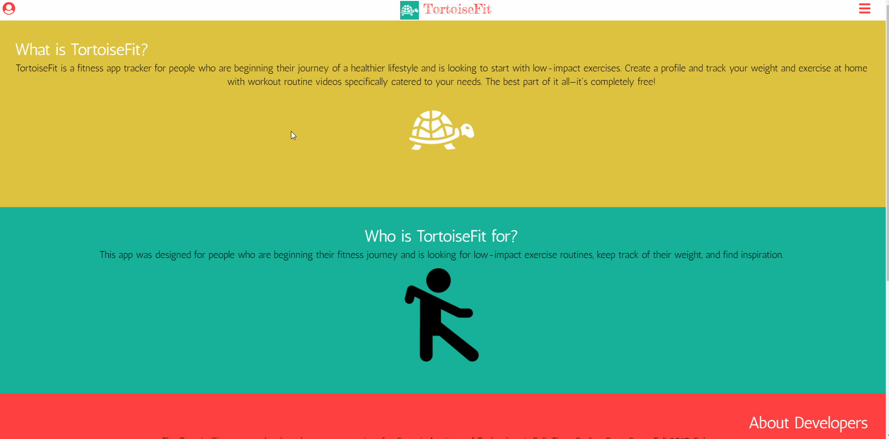

# TortoiseFit

## Table of Contents
+ [Overview](#overview)  
+ [Visuals](#visuals)
+ [Assignment](#assignment)
+ [Future Development](#future-development)
+ [Contributing](#contributing)
+ [Acknowledgments](#acknowledgments)
+ [License](#license)

## Overview
TortoiseFit is a mobile-friendly fitness web application for people who are beginning their fitness journey. Users can create a profile to keep track of their weight and exercises. 

## Visuals

## Assignment
This application was a group project for [GA Tech's Coding Program](https://codingbootcamp.pe.gatech.edu/), Full-Time Fall 2017 Cohort. 

### Collaborators
+ **Back End**: [Corey Sullivan](https://www.github.com/co-su) and [Scott Hunter](https://www.github.com/scotthhunter)
+ **Front End**: [Brian Peace](https://www.github.com/bpeace71) and [Keli Chau](https://www.github.com/kelichau)

### Requirements
+ Node.js
+ Express.js
+ MySQL Database with Sequelize ORM
+ GET and POST routes
+ Heroku for deployment
+ Utilize a new library, package, or technology
+ Polished UI
+ Folder structure that meets MVC Paradigm
+ Good quality coding standards

### User Story
1. Users can find out what amount of exercise will help them reach their weight goal the fastest based on calorie input 
+ User can login to their account (optional Facebook, Google Plus, or Twitter login)
+ Input fields for new users
  + Current weight
  + Current height
  + Age
  + Body Frame
  + Desired weight to lose
+ Submit Button
+ Animation for processing post submission
+ Page choice to track progress

2. Results page based on user input
+ View individual results
+ View suggested exercise and nutrition routines based on weight goal
+ View customized exercise routine based on 1500 calorie diet for weight loss goal input

3. User can view video example of each exercise in suggested routine
4. User can see a timeline for their goal based on max and min exercise input
5. User can access a menu option called "Tracking your progress " with a time stamp of the weight inputs history
6. User can clear previous individual weight 
7. User can compare their goal weight and current weight at the top of the app

## Future Development
+ Add account settings
+ Enable email or username login options
+ Incorporate nearest gyms
+ Incorporate nearby fitness instructors
+ Incorporate nearby fitness events (I.E. marathons)
+ Link all pages
+ Expandable FAQ page 

## Contributing
1. Fork this repository
2. Create your feature branch: `git checkout -b my-new-feature`
3. Commit your changes: `git commit -am 'Add some feature'`
4. Push to the branch: `git push origin my-new-feature`
5. Submit a pull request

## Acknowledgments
+ Node
+ Express
+ Passport
+ Express-Session
+ Dotenv
+ Express-Handlebars
+ MySQL
+ Sequelize
+ Pikabu
+ Bootstrap
+ Google Fonts
+ Google Analytics

<<<<<<< HEAD
## License
### MIT License

#### Copyright (c) 2018 TortoiseFit

Permission is hereby granted, free of charge, to any person obtaining a copy
of this software and associated documentation files (the "Software"), to deal
in the Software without restriction, including without limitation the rights
to use, copy, modify, merge, publish, distribute, sublicense, and/or sell
copies of the Software, and to permit persons to whom the Software is
furnished to do so, subject to the following conditions:

The above copyright notice and this permission notice shall be included in all
copies or substantial portions of the Software.

THE SOFTWARE IS PROVIDED "AS IS", WITHOUT WARRANTY OF ANY KIND, EXPRESS OR
IMPLIED, INCLUDING BUT NOT LIMITED TO THE WARRANTIES OF MERCHANTABILITY,
FITNESS FOR A PARTICULAR PURPOSE AND NONINFRINGEMENT. IN NO EVENT SHALL THE
AUTHORS OR COPYRIGHT HOLDERS BE LIABLE FOR ANY CLAIM, DAMAGES OR OTHER
LIABILITY, WHETHER IN AN ACTION OF CONTRACT, TORT OR OTHERWISE, ARISING FROM,
OUT OF OR IN CONNECTION WITH THE SOFTWARE OR THE USE OR OTHER DEALINGS IN THE
SOFTWARE.

### [:top:](#TortoiseFit)
=======
## Future Plans
+ Add account settings
+ Enable email or username login options
+ Incorporate nearest gyms
+ Incorporate nearby fitness instructors
+ Incorporate nearby fitness events (I.E. marathons)
+ Link all pages
+ Expandable FAQ page 
>>>>>>> 878d8d3121fa3410824df538e8647934e65fa514
